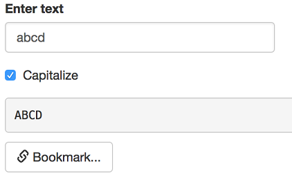

```{r setup, include=FALSE}
knitr::opts_chunk$set(echo = FALSE)
```
## 1. Understand how your app allocates time
`Profvis`  <br>
- Interactive visualizer for profiling R code <br><br>


## 2. Speed up app when loading data
<center>  </center>
- Save data as `feather` files

## 3. Speed up app using plot caching
 `renderCachedPlot` <br>
- Stores rendered plots in a cache

## 4. Limit rates for updating user input
 `throttle`  <br>
- Delays executing a function to once per specified time

## 5. Check Preconditions
`req()` <br>
Cancel the current output if one or more conditions are not met  

## 6. Steamline Complicated Code with Shiny Modules
- Compose complex apps out of smaller pieces
- Avoid namespace collisions

## 7. Update edited files automatically
`Reactivefilereader` <br>
- Reads the last-modified time of the file <br>
- If timestamp changes, re-reads the file

## 8. Reproduce user input
`BookmarkButton()` <br>
-Automatically saves input values so it can be referenced later <br><br>


## 9. Automate testing
`Shinytest` <br>
- Makes recordings of user interaction with the app <br>
- Alerts developer if updates make the app unexpectedly change

## 10. Optimize app for consistency
`Shinyloadtest`, `Shinycannon` <br>
- Hits app with multiple users to show impact on app performance
